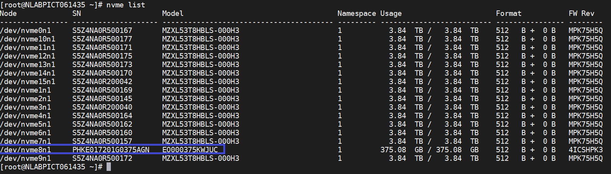

= HPE DL380의 드라이브를 교체합니다
:allow-uri-read: 
:icons: font
:imagesdir: ../media/

[role="lead"]
여기에 나열된 절차 중 하나를 선택하여 드라이브를 사전에 교체하고 장애가 발생한 드라이브를 교체한 후 캐시 드라이브를 교체합니다. SolidFire ESDS 클러스터에서 메타데이터 드라이브 또는 블록 드라이브를 교체합니다. Element UI * Cluster > Drives * 페이지에는 드라이브 마모 정보가 표시됩니다.

* <<Replace a drive proactively>>
* <<Replace a faulty drive>>
* <<Replace a cache drive>>

== 드라이브를 사전에 교체합니다

SolidFire ESDS 클러스터의 메타데이터 드라이브 또는 블록 드라이브를 사전에 교체하려면 이 절차를 수행하십시오. Element UI * Cluster * > * Drives * 페이지에는 드라이브 마모 정보가 표시됩니다.

.무엇을 &#8217;필요로 할거야
* NetApp Element 소프트웨어 UI에서 클러스터의 상태가 양호하고 경고 또는 클러스터 오류가 없는지 확인합니다. 기본 클러스터 노드의 관리 가상 IP(MVIP) 주소를 사용하여 Element UI에 액세스할 수 있습니다.
* 클러스터에서 실행 중인 활성 작업이 없는지 확인합니다.
* 모든 단계에 익숙해졌는지 확인하십시오.
* 드라이브를 취급할 때 정전기 방전(ESD)을 방지하기 위해 필요한 예방 조치를 취해야 합니다.

.단계
. Element UI에서 다음 단계를 수행합니다.
+
.. Element UI에서 * Cluster * > * Drives * > * Active * 를 선택합니다.
.. 교체할 드라이브를 선택합니다.
.. 드라이브의 일련 번호를 기록해 둡니다. 이렇게 하면 노드의 IPMI 인터페이스(이 경우 HPE Integrated Lights-Out 또는 iLO)에서 해당 BayID를 찾는 데 도움이 됩니다.
.. 대량 작업 * > * 제거 * 를 선택합니다. 드라이브를 분리하면 드라이브가 * Removing * 상태로 전환됩니다. 드라이브의 데이터가 클러스터의 나머지 드라이브에 동기화되거나 재배포될 때까지 기다리면서 * Removing * 상태로 유지됩니다. 제거 작업이 완료되면 드라이브가 * 사용 가능 * 상태로 이동합니다.

. 교체할 드라이브의 드라이브 슬롯을 찾으려면 다음 단계를 수행하십시오.
+
.. 노드의 IPMI 인터페이스에 로그인합니다(이 경우 iLO).
.. 왼쪽 탐색 모음에서 * 시스템 정보 * 를 선택한 다음 * 저장소 * 를 선택합니다.
.. 이전 단계에서 기록한 일련 번호와 화면에 표시된 일련 번호를 일치시킵니다.
.. 일련 번호에 대해 나열된 슬롯 번호를 찾습니다. 드라이브를 분리해야 하는 물리적 슬롯입니다.

. 이제 드라이브를 확인했으므로 다음과 같이 물리적으로 제거하십시오.
+
.. 드라이브 상자를 식별합니다.
+
다음 이미지는 드라이브가 장착된 서버의 앞면을 보여줍니다.

+
image::../media/esds_drive_dl380.jpg[에서는 DL380 노드의 드라이브를 보여 줍니다.]

.. 교체할 드라이브의 전원 단추를 누릅니다. LED가 5-10초 동안 깜박인 후 멈춥니다.
.. LED가 깜박임을 멈추고 드라이브의 전원을 끈 후 빨간색 단추를 누르고 래치를 당겨 서버에서 드라이브를 분리합니다.
+

NOTE: 드라이브를 조심스럽게 다루는지 확인하십시오.

+
드라이브를 물리적으로 제거한 후 요소 UI에서 드라이브 상태가 * 실패 * 로 변경됩니다.

. Element UI에서 * Cluster * > * Drives * > * Failed * 를 선택합니다.
. Actions * 에서 아이콘을 선택한 다음 * Remove * 를 선택합니다.
+
이제 계속해서 새 드라이브를 노드에 설치할 수 있습니다.

. 새 드라이브의 일련 번호를 기록해 둡니다.
. 래치를 사용하여 드라이브를 베이에 조심스럽게 밀어 넣어 교체 드라이브를 삽입합니다. 드라이브가 올바르게 삽입되면 전원이 켜집니다.
. iLO에서 새 드라이브 세부 정보를 확인하려면 다음 단계를 수행하십시오.
+
.. iLO에 로그인합니다.
.. 정보 * > * 통합 관리 로그 * 를 선택합니다. 추가한 드라이브에 대해 기록된 이벤트가 표시됩니다.
.. 왼쪽 탐색 모음에서 * 시스템 정보 * 를 선택한 다음 * 저장소 * 를 선택합니다.
.. 드라이브를 교체한 베이에 대한 정보를 찾을 때까지 스크롤합니다.
.. 화면의 일련 번호가 교체한 새 드라이브의 일련 번호와 일치하는지 확인합니다.

. 드라이브를 교체한 노드의 'f_sds_config.yAML' 파일에 새 드라이브 정보를 추가합니다.
+
S_SDS_config.YAML 파일은 "/opt/sf/"에 저장됩니다. 이 파일에는 노드의 드라이브에 대한 모든 정보가 포함됩니다. 드라이브를 교체할 때마다 이 파일에 교체 드라이브 정보를 입력해야 합니다. 이 파일에 대한 자세한 내용은 를 참조하십시오 link:reference_esds_sf_sds_config_file.html["SF_SDS_config.YAML 파일의 내용입니다"^].

+
.. PuTTY를 사용하여 노드에 대한 SSH 연결을 설정합니다.
.. PuTTY 구성 창에서 * 호스트 이름(또는 IP 주소) * 필드에 노드 MIP를 입력합니다.
.. 열기 * 를 선택합니다.
.. 터미널 창이 열리면 사용자 이름과 암호를 사용하여 로그인합니다.
.. 파일의 내용을 나열하려면 '#cat/opt/sf/sf_sds_config.yAML' 명령을 실행합니다.
.. 새 드라이브 정보로 교체한 드라이브의 "캐시 장치" 또는 "캐시 장치" 목록의 항목을 교체합니다.
.. '#systemctl start solidfire-update-drives'를 실행합니다.
+
이 명령을 실행하면 Bash 프롬프트가 표시됩니다. 이후에 Element UI로 이동하여 클러스터에 드라이브를 추가해야 합니다. Element UI에는 사용 가능한 새 드라이브에 대한 경고가 표시됩니다.

. Cluster * > * Drives * > * Available * 을 선택합니다.
+
설치한 새 드라이브의 일련 번호가 표시됩니다.

. Actions * 에서 아이콘을 선택한 다음 * Add * 를 선택합니다.
. 블록 동기화 작업이 완료된 후 Element UI를 새로 고칩니다. Element UI의 * Reporting * 탭에서 * Running Tasks * 페이지에 액세스하면 사용 가능한 드라이브에 대한 경고가 지워졌습니다.

== 결함이 있는 드라이브를 교체합니다

SolidFire ESDS 클러스터에 결함이 있는 드라이브가 있으면 Element UI에 경고가 표시됩니다. 클러스터에서 드라이브를 제거하기 전에 노드/서버의 IPMI 인터페이스에 있는 정보를 확인하여 실패 원인을 확인하십시오. 다음 단계는 블록 드라이브 또는 메타데이터 드라이브를 교체하는 경우에 적용됩니다.

.무엇을 &#8217;필요로 할거야
* NetApp Element 소프트웨어 UI에서 드라이브에 오류가 있는지 확인합니다. 요소에 드라이브 장애가 발생하면 경고가 표시됩니다. 기본 클러스터 노드의 관리 가상 IP(MVIP) 주소를 사용하여 Element UI에 액세스할 수 있습니다.
* 모든 단계에 익숙해졌는지 확인하십시오.
* 드라이브를 취급할 때 정전기 방전(ESD)을 방지하기 위해 필요한 예방 조치를 취해야 합니다.

.단계
. Element UI를 사용하여 다음과 같이 클러스터에서 장애가 발생한 드라이브를 제거합니다.
+
.. Cluster * > * Drives * > * Failed * 를 선택합니다.
.. 장애가 발생한 드라이브와 관련된 노드 이름 및 일련 번호를 확인합니다.
.. Actions * 에서 아이콘을 선택한 다음 * Remove * 를 선택합니다. 드라이브에 연결된 서비스에 대한 경고가 표시되면 출력함 동기화가 완료될 때까지 기다린 다음 드라이브를 제거합니다.

. 다음 단계를 수행하여 드라이브 오류를 확인하고 드라이브 장애와 관련하여 기록된 이벤트를 확인하십시오.
+
.. 노드의 IPMI 인터페이스에 로그인합니다(이 경우 iLO).
.. 정보 * > * 통합 관리 로그 * 를 선택합니다. 드라이브 장애 원인(예: SSDWearOut)과 위치가 여기에 나열됩니다. 드라이브의 상태가 저하됨이라는 이벤트를 볼 수도 있습니다.
.. 왼쪽 탐색 모음에서 * 시스템 정보 * 를 선택한 다음 * 저장소 * 를 선택합니다.
.. 오류가 발생한 드라이브에 대한 정보를 확인합니다. 오류가 발생한 드라이브의 상태가 * Degraded * 로 표시됩니다.

. 다음과 같이 드라이브를 물리적으로 분리합니다.
+
.. 섀시에서 드라이브를 확인합니다.
+
다음 이미지는 드라이브가 장착된 서버의 앞면을 보여줍니다.

+
image::../media/esds_drive_dl380.jpg[에서는 DL380 노드의 드라이브를 보여 줍니다.]

.. 교체할 드라이브의 전원 단추를 누릅니다. LED가 5-10초 동안 깜박인 후 멈춥니다.
.. LED가 깜박임을 멈추고 드라이브의 전원을 끈 후 빨간색 단추를 누르고 래치를 당겨 서버에서 드라이브를 분리합니다.
+

NOTE: 드라이브를 조심스럽게 다루는지 확인하십시오.

. 래치를 사용하여 드라이브를 베이에 조심스럽게 밀어 넣어 교체 드라이브를 삽입합니다. 드라이브가 올바르게 삽입되면 전원이 켜집니다.
. iLO에서 새 드라이브 세부 정보를 확인합니다.
+
.. 정보 * > * 통합 관리 로그 * 를 선택합니다. 추가한 드라이브에 대해 기록된 이벤트가 표시됩니다.
.. 페이지를 새로 고쳐 추가한 새 드라이브에 대해 기록된 이벤트를 확인합니다.

. iLO에서 스토리지 시스템의 상태를 확인합니다.
+
.. 왼쪽 탐색 모음에서 * 시스템 정보 * 를 선택한 다음 * 저장소 * 를 선택합니다.
.. 새 드라이브를 설치한 베이에 대한 정보를 찾을 때까지 스크롤합니다.
.. 일련 번호를 기록해 둡니다.

. 드라이브를 교체한 노드의 'f_sds_config.yAML' 파일에 새 드라이브 정보를 추가합니다.
+
S_SDS_config.YAML 파일은 "/opt/sf/"에 저장됩니다. 이 파일에는 노드의 드라이브에 대한 모든 정보가 포함됩니다. 드라이브를 교체할 때마다 이 파일에 교체 드라이브 정보를 입력해야 합니다. 이 파일에 대한 자세한 내용은 를 참조하십시오 link:reference_esds_sf_sds_config_file.html["SF_SDS_config.YAML 파일의 내용입니다"^].

+
.. PuTTY를 사용하여 노드에 대한 SSH 연결을 설정합니다.
.. PuTTY 구성 창에서 * 호스트 이름(또는 IP 주소) * 필드에 노드 MIP를 입력합니다.
.. 열기 * 를 선택합니다.
.. 터미널 창이 열리면 사용자 이름과 암호를 사용하여 로그인합니다.
.. 파일의 내용을 나열하려면 '#cat/opt/sf/sf_sds_config.yAML' 명령을 실행합니다.
.. 새 드라이브 정보로 교체한 드라이브의 "캐시 장치" 또는 "캐시 장치" 목록의 항목을 교체합니다.
.. '#systemctl start solidfire-update-drives'를 실행합니다.
+
이 명령을 실행하면 Bash 프롬프트가 표시됩니다. 이후에 Element UI로 이동하여 클러스터에 드라이브를 추가해야 합니다. Element UI에는 사용 가능한 새 드라이브에 대한 경고가 표시됩니다.

. Cluster * > * Drives * > * Available * 을 선택합니다.
+
설치한 새 드라이브의 일련 번호가 표시됩니다.

. Actions * 에서 아이콘을 선택한 다음 * Add * 를 선택합니다.
. 블록 동기화 작업이 완료된 후 Element UI를 새로 고칩니다. Element UI의 * Reporting * 탭에서 * Running Tasks * 페이지에 액세스하면 사용 가능한 드라이브에 대한 경고가 지워졌습니다.

== 캐시 드라이브를 교체합니다

SolidFire ESDS 클러스터의 캐시 드라이브를 교체하려면 이 절차를 수행합니다. 캐시 드라이브는 메타데이터 서비스와 연결됩니다. Element UI * Cluster * > * Drives * 페이지에는 드라이브 마모 정보가 표시됩니다.

.무엇을 &#8217;필요로 할거야
* NetApp Element 소프트웨어 UI에서 클러스터의 상태가 양호하고 경고 또는 클러스터 오류가 없는지 확인합니다. 기본 클러스터 노드의 관리 가상 IP(MVIP) 주소를 사용하여 Element UI에 액세스할 수 있습니다.
* 클러스터에서 실행 중인 활성 작업이 없는지 확인합니다.
* 모든 단계에 익숙해졌는지 확인하십시오.
* Element UI에서 메타데이터 서비스를 제거해야 합니다.
* 드라이브를 취급할 때 정전기 방전(ESD)을 방지하기 위해 필요한 예방 조치를 취해야 합니다.

.단계
. Element UI에서 다음 단계를 수행합니다.
+
.. Element UI에서 * Cluster * > * Nodes * > * Active * 를 선택합니다.
.. 캐시 드라이브를 교체할 노드의 노드 ID 및 관리 IP 주소를 기록해 둡니다.
.. 캐시 드라이브가 정상이고 사전에 교체하는 경우 * 활성 드라이브 * 를 선택하고 메타데이터 드라이브를 찾은 다음 UI에서 제거합니다.
+
메타데이터 드라이브를 제거하면 먼저 * 제거 * 상태로 이동한 다음 * 사용 가능 * 으로 이동합니다.

.. 캐시 드라이브에 장애가 발생한 후 교체를 수행하는 경우 메타데이터 드라이브는 * 사용 가능 * 상태가 되며 * 클러스터 * > * 드라이브 * > * 사용 가능 * 아래에 나열됩니다.
.. Element UI에서 * Cluster * > * Drives * > * Active * 를 선택합니다.
.. NodeName과 연결된 메타데이터 드라이브를 선택합니다. 여기에서 캐시 드라이브를 교체할 수 있습니다.
.. 대량 작업 * > * 제거 * 를 선택합니다. 드라이브를 분리하면 드라이브가 * Removing * 상태로 전환됩니다. 드라이브의 데이터가 클러스터의 나머지 드라이브에 동기화되거나 재배포될 때까지 기다리면서 * Removing * 상태로 유지됩니다. 제거 작업이 완료되면 드라이브가 * 사용 가능 * 상태로 이동합니다.

. 교체할 캐시 드라이브의 드라이브 슬롯을 찾으려면 다음 단계를 수행하십시오.
+
.. 노드의 IPMI 인터페이스에 로그인합니다(이 경우 iLO).
.. 왼쪽 탐색 모음에서 * 시스템 정보 * 를 선택한 다음 * 저장소 * 를 선택합니다.
.. 캐시 드라이브를 찾습니다.
+

NOTE: 캐시 드라이브는 스토리지 드라이브보다 용량이 적습니다.

.. 캐시 드라이브에 대해 나열된 슬롯 번호를 찾습니다. 드라이브를 분리해야 하는 물리적 슬롯입니다.

. 이제 드라이브를 확인했으므로 다음과 같이 물리적으로 제거하십시오.
+
.. 드라이브 상자를 식별합니다.
+
다음 이미지는 드라이브가 장착된 서버의 앞면을 보여줍니다.

+
image::../media/esds_drive_dl380.jpg[에서는 DL380 노드의 드라이브를 보여 줍니다.]

.. 교체할 드라이브의 전원 단추를 누릅니다. LED가 5-10초 동안 깜박인 후 멈춥니다.
.. LED가 깜박임을 멈추고 드라이브의 전원을 끈 후 빨간색 단추를 누르고 래치를 당겨 서버에서 드라이브를 분리합니다.
+

NOTE: 드라이브를 조심스럽게 다루는지 확인하십시오.

+
드라이브를 물리적으로 제거한 후 요소 UI에서 드라이브 상태가 * 실패 * 로 변경됩니다.

. HPE 모델 번호와 새 캐시 드라이브의 ISN(일련 번호)을 기록해 둡니다.
. 래치를 사용하여 드라이브를 베이에 조심스럽게 밀어 넣어 교체 드라이브를 삽입합니다. 드라이브가 올바르게 삽입되면 전원이 켜집니다.
. iLO에서 새 드라이브 세부 정보를 확인하려면 다음 단계를 수행하십시오.
+
.. iLO에 로그인합니다.
.. 정보 * > * 통합 관리 로그 * 를 선택합니다. 추가한 드라이브에 대해 기록된 이벤트가 표시됩니다.
.. 왼쪽 탐색 모음에서 * 시스템 정보 * 를 선택한 다음 * 저장소 * 를 선택합니다.
.. 드라이브를 교체한 베이에 대한 정보를 찾을 때까지 스크롤합니다.
.. 화면의 일련 번호가 설치한 새 드라이브의 일련 번호와 일치하는지 확인합니다.

. 드라이브를 교체한 노드의 'f_sds_config.yAML' 파일에 새 캐시 드라이브 정보를 추가합니다.
+
S_SDS_config.YAML 파일은 "/opt/sf/"에 저장됩니다. 이 파일에는 노드의 드라이브에 대한 모든 정보가 포함됩니다. 드라이브를 교체할 때마다 이 파일에 교체 드라이브 정보를 입력해야 합니다. 이 파일에 대한 자세한 내용은 를 참조하십시오 link:reference_esds_sf_sds_config_file.html["SF_SDS_config.YAML 파일의 내용입니다"^].

+
.. PuTTY를 사용하여 노드에 대한 SSH 연결을 설정합니다.
.. PuTTY 구성 창에서 * 호스트 이름(또는 IP 주소) * 필드에 노드 MIP 주소(요소 UI에서 기록해 둔 주소)를 입력합니다.
.. 열기 * 를 선택합니다.
.. 터미널 창이 열리면 사용자 이름과 암호를 사용하여 로그인합니다.
.. "NVMe list" 명령을 실행하여 NMVe 디바이스를 나열합니다.
+
새 캐시 드라이브의 모델 번호 및 일련 번호를 확인할 수 있습니다. 다음 샘플 출력을 참조하십시오.

+

.. '/opt/sf/sf_sds_config.yAML'에서 새 캐시 드라이브 정보를 추가합니다.
+
기존 캐시 드라이브 모델 번호 및 일련 번호를 새 캐시 드라이브에 대한 해당 정보로 교체해야 합니다. 다음 예를 참조하십시오.

+

.. '/opt/sf/sf_sds_config.yAML' 파일을 저장한다.

. 해당되는 시나리오에 대한 단계를 수행합니다.
+
[cols="2*"]
|===
| 시나리오 | 단계 

| "NVMe list" 명령을 실행하면 새로 삽입한 캐시 드라이브가 나타납니다  a| 
.. '#systemctl restart SolidFire'를 실행합니다. 이 작업은 약 3분 정도 걸립니다.
.. System status SolidFire를 실행하여 SolidFire 상태를 확인한다.
.. 9단계로 이동합니다.

| "NVMe list" 명령을 실행한 후 새로 삽입한 캐시 드라이브가 표시되지 않습니다  a| 
.. 노드를 재부팅합니다.
.. 노드가 재부팅된 후 PuTTY를 사용하여 노드에 로그인하고 'System status SolidFire' 명령을 실행하여 SolidFire 서비스가 실행 중인지 확인합니다.
.. 9단계로 이동합니다.

|===
+

NOTE: SolidFire를 재시작하거나 노드를 재부팅하면 일부 클러스터 장애가 발생하여 5분 이내에 해결됩니다.

. Element UI에서 제거한 메타데이터 드라이브를 다시 추가합니다.
+
.. Cluster * > * Drives * > * Available * 을 선택합니다.
.. 작업 아래에서 아이콘을 선택하고 * 추가 * 를 선택합니다.

. 블록 동기화 작업이 완료된 후 Element UI를 새로 고칩니다.
+
사용 가능한 드라이브에 대한 경고가 다른 클러스터 오류와 함께 지워졌습니다.

== 자세한 내용을 확인하십시오

* https://www.netapp.com/data-storage/solidfire/documentation/["NetApp SolidFire 리소스 페이지 를 참조하십시오"^]
* https://docs.netapp.com/sfe-122/topic/com.netapp.ndc.sfe-vers/GUID-B1944B0E-B335-4E0B-B9F1-E960BF32AE56.html["이전 버전의 NetApp SolidFire 및 Element 제품에 대한 문서"^]

