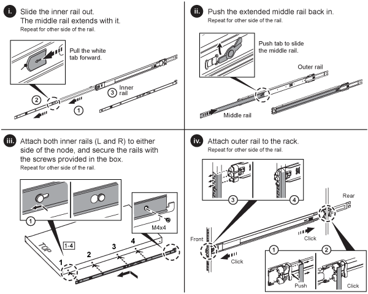

= H 시리즈 스토리지 노드를 설치합니다
:allow-uri-read: 
:icons: font
:imagesdir: ../media/

[role="lead"]
All-Flash 스토리지 시스템을 시작하기 전에 스토리지 노드를 올바르게 설치 및 설정해야 합니다.

TIP: 를 참조하십시오 link:../media/hseries_isi.pdf["포스터"^] 를 참조하십시오.

* <<워크플로 다이어그램>>
* <<설치 준비>>
* <<레일을 설치합니다>>
* <<노드를 설치하고 케이블을 연결합니다>>
* <<노드를 구성합니다>>
* <<클러스터를 생성합니다>>

== 워크플로 다이어그램

이 워크플로우 다이어그램은 설치 단계에 대한 개괄적인 개요를 제공합니다. H 시리즈 모델에 따라 단계가 약간 다릅니다.

=== H410S

image::../media/h410s_isi_workflow.png[H410S 설치 워크플로우]

=== H610S

NOTE: H610S의 경우 노드와 섀시가 2U 4노드 섀시의 경우와 달리 서로 다른 구성 요소가 아니기 때문에 "노드" 및 "섀시"라는 용어는 혼용하여 사용됩니다.

image::../media/h610s_isi_workflow.png[H610S 설치 워크플로우]

== 설치 준비

설치 준비 과정에서 제공된 하드웨어의 인벤토리를 조사하고 누락된 항목이 있으면 NetApp 지원에 문의하십시오.

설치 위치에 다음 항목이 있는지 확인합니다.

* 시스템을 위한 랙 공간.

[cols="2*"]
|===
| 노드 유형입니다 | 랙 공간 

| H410S 노드 | 랙 유닛 2개(2U) 

| H610S 노드 | 랙 유닛 1개(1U) 
|===
* SFP28/SFP+ 직접 연결 케이블 또는 트랜시버
* RJ45 커넥터가 있는 CAT5e 이상의 케이블
* 시스템을 구성하기 위한 키보드, 비디오, 마우스(KVM) 스위치입니다
* USB 스틱(옵션)

TIP: 사용자에게 제공되는 하드웨어는 주문한 제품에 따라 다릅니다. 새로운 2U 4노드 주문에는 섀시, 베젤, 슬라이드 레일 키트, 드라이브, 스토리지 노드, 및 전원 케이블(섀시당 2개). H610S 스토리지 노드를 주문하는 경우 드라이브는 섀시에 설치됩니다.

CAUTION: 하드웨어를 설치하는 동안, 모든 포장재를 제거하고 장치에서 포장해야 합니다. 이렇게 하면 노드의 과열 및 종료를 방지할 수 있습니다.

== 레일을 설치합니다

제공된 하드웨어 주문에는 슬라이드 레일 세트가 포함되어 있습니다. 레일 설치를 완료하려면 드라이버가 필요합니다. 설치 단계는 각 노드 모델에 따라 약간 다릅니다.

TIP: 장비가 넘어지지 않도록 랙 하단에서 상단까지 하드웨어를 설치합니다. 랙에 고정 장치가 포함되어 있는 경우 하드웨어를 설치하기 전에 장치를 설치하십시오.

* <<H410S>>
* <<H610S>>

=== H410S

H410S 노드는 2개의 어댑터 세트와 함께 제공되는 2U, 4노드 H 시리즈 섀시에 설치됩니다. 둥근 구멍이 있는 랙에 섀시를 설치하려면 둥근 구멍이 있는 랙에 적합한 어댑터를 사용하십시오. H410S 노드의 레일은 깊이 29인치에서 33.5인치 사이의 랙에 맞습니다. 레일이 완전히 수축되면 길이는 28인치이고 레일의 전면과 후면은 하나의 나사에 의해 함께 고정됩니다.

CAUTION: 완전히 수축된 레일에 섀시를 설치하는 경우 레일의 전면 및 후면 섹션이 분리될 수 있습니다.

.단계
. 랙의 전면 포스트에 있는 구멍에 레일의 전면을 맞춥니다.
. 레일 전면의 후크를 랙 전면 포스트의 구멍에 밀어 넣은 다음 스프링 장착 페그가 랙 구멍에 끼워질 때까지 아래로 누릅니다.
. 나사를 사용하여 레일을 랙에 장착합니다. 다음은 랙 전면에 연결되는 왼쪽 레일의 그림입니다.
+
image::../media/h410s_rail.gif[2U 레일 설치]

. 레일의 후면 섹션을 랙의 후면 포스트로 확장합니다.
. 레일 후면의 후크를 후면 포스트의 적절한 구멍에 맞춰 정렬함으로써 레일의 전면과 후면이 같은 높이에 있도록 합니다.
. 레일 후면을 랙에 장착하고 나사로 레일을 고정합니다.
. 랙의 다른 쪽에 대해 위의 단계를 모두 수행합니다.

=== H610S

다음은 H610S 스토리지 노드의 레일 설치를 위한 그림입니다.

TIP: H610S에는 왼쪽과 오른쪽 레일이 있습니다. H610S 나비나사가 섀시를 레일에 고정할 수 있도록 나사 구멍을 바닥 쪽으로 배치합니다.

== 노드를 설치하고 케이블을 연결합니다

H410S 스토리지 노드를 2U 4노드 섀시에 설치합니다. H610S의 경우 섀시/노드를 랙의 레일에 직접 설치합니다.

CAUTION: 모든 포장재를 제거하고 장치에서 포장합니다. 이렇게 하면 노드의 과열 및 종료를 방지할 수 있습니다.

* <<H410S>>
* <<H610S>>

=== H410S

.단계
. 섀시에 H410S 노드를 설치합니다. 다음은 4개의 노드가 설치된 섀시의 후면 예입니다.
+
image::../media/sf_isi_chassis_rear.png[이 그림은 2U의 후면을 보여줍니다]

+

WARNING: 하드웨어를 들어올리고 랙에 설치할 때는 주의하십시오. 빈 2개의 랙 유닛(2U), 4노드 섀시의 중량은 24.45lb(24.7kg)이고 노드 무게는 3.6kg(8.0lb)입니다.

. 드라이브를 설치합니다.
+
image::../media/hci_stor_node_ssd_bays.gif[이 그림은 2U의 전면을 보여줍니다]

. 노드를 케이블로 연결합니다.
+

IMPORTANT: 섀시 후면의 공기 환풍구가 케이블 또는 레이블에 의해 막히면 과열되어 구성 요소에 조기 오류가 발생할 수 있습니다.

+
image::../media/hci_isi_storage_cabling.png[이 그림은 H410S 스토리지 노드의 케이블링을 보여줍니다.]

+
** 관리 연결을 위해 포트 A 및 B에 CAT5e 이상의 케이블 2개를 연결합니다.
** 스토리지 연결을 위해 포트 C 및 D에 있는 SFP28/SFP+ 케이블 2개 또는 트랜시버를 연결합니다.
** (선택 사항, 권장) 대역외 관리 연결을 위해 IPMI 포트에 CAT5e 케이블을 연결합니다.

. 전원 코드를 섀시당 2개의 전원 공급 장치에 연결하고 240V PDU 또는 전원 콘센트에 꽂습니다.
. 노드의 전원을 켭니다.
+

NOTE: 노드가 부팅되려면 약 6분이 걸립니다.

+
image::../media/hci_poweron_isg.gif[이 그림은 2U에 있는 노드의 전원 단추를 보여 줍니다]

=== H610S

.단계
. H610S 섀시를 설치합니다. 다음은 랙에 노드/섀시를 설치하는 그림입니다.
+
image::../media/h610s_chassis_isi.gif[에서는 H610S 노드/섀시가 랙에 설치되어 있음을 보여 줍니다.]

+

WARNING: 하드웨어를 들어올리고 랙에 설치할 때는 주의하십시오. H610S 섀시의 중량은 18.4kg(40.5lb)입니다.

. 노드를 케이블로 연결합니다.
+

IMPORTANT: 섀시 후면의 공기 환풍구가 케이블 또는 레이블에 의해 막히면 과열되어 구성 요소에 조기 오류가 발생할 수 있습니다.

+
image::../media/h600s_isi_noderear.png[이 그림은 H610S 스토리지 노드의 케이블 연결을 보여 줍니다.]

+
** SFP28 또는 SFP+ 케이블 2개를 사용하여 10/25GbE 네트워크에 노드를 연결합니다.
** RJ45 커넥터 2개를 사용하여 1GbE 네트워크에 노드를 연결합니다.
** IPMI 포트의 RJ-45 커넥터를 사용하여 노드를 1GbE 네트워크에 연결합니다.
** 두 전원 케이블을 노드에 연결합니다.

. 노드의 전원을 켭니다.
+

NOTE: 노드가 부팅될 때까지 약 5분 30초 정도 걸립니다.

+
image::../media/h600s_isi_nodefront.png[이 그림은 전원 버튼이 강조 표시된 H610S 섀시의 전면을 보여줍니다.]

== 노드를 구성합니다

하드웨어를 랙에 장착하고 케이블을 연결한 후에는 새 스토리지 리소스를 구성할 준비가 된 것입니다.

.단계
. 키보드와 모니터를 노드에 연결합니다.
. 표시되는 터미널 사용자 인터페이스(TUI)에서 화면 탐색을 사용하여 노드에 대한 네트워크 및 클러스터 설정을 구성합니다.
+

NOTE: TUI에서 노드의 IP 주소를 받아야 합니다. 클러스터에 노드를 추가할 때 이 기능이 필요합니다. 설정을 저장하면 노드가 보류 중 상태가 되고 클러스터에 추가될 수 있습니다. 설치 섹션 링크 삽입>을 참조하십시오.

. 베이스보드 관리 컨트롤러(BMC)를 사용하여 대역외 관리를 구성합니다. 이 단계는 H610S * 노드에만 적용됩니다.
+
.. 웹 브라우저를 사용하여 기본 BMC IP 주소 192.168.0.120으로 이동합니다
.. 사용자 이름으로 * root * 를 사용하고 암호로 * calvin * 을 사용하여 로그인합니다.
.. 노드 관리 화면에서 * 설정 * > * 네트워크 설정 * 으로 이동하고 대역외 관리 포트에 대한 네트워크 매개 변수를 구성합니다.

TIP: 을 참조하십시오 https://kb.netapp.com/Advice_and_Troubleshooting/Hybrid_Cloud_Infrastructure/NetApp_HCI/How_to_access_BMC_and_change_IP_address_on_H610S["이 KB 문서(로그인 필요)"].

== 클러스터를 생성합니다

설치 환경에 스토리지 노드를 추가하고 새 스토리지 리소스를 구성한 후에는 새 스토리지 클러스터를 생성할 수 있습니다

.단계
. 새로 구성된 노드와 동일한 네트워크에 있는 클라이언트에서 노드의 IP 주소를 입력하여 NetApp Element 소프트웨어 UI에 액세스합니다.
. Create a New Cluster** 창에 필요한 정보를 입력합니다. 를 참조하십시오 link:../setup/concept_setup_overview.html["설정 개요"^] 를 참조하십시오.

== 자세한 내용을 확인하십시오

* https://www.netapp.com/data-storage/solidfire/documentation/["NetApp SolidFire 리소스 페이지 를 참조하십시오"^]
* https://docs.netapp.com/sfe-122/topic/com.netapp.ndc.sfe-vers/GUID-B1944B0E-B335-4E0B-B9F1-E960BF32AE56.html["이전 버전의 NetApp SolidFire 및 Element 제품에 대한 문서"^]

