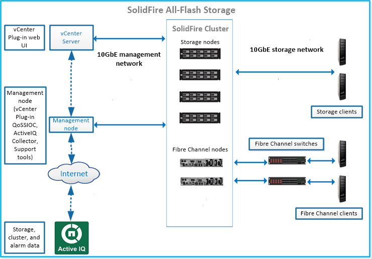

= SolidFire 스토리지 시스템
:allow-uri-read: 
:icons: font
:imagesdir: ../media/

[role="lead"]
SolidFire All-Flash 스토리지 시스템은 개별 하드웨어 구성요소(드라이브 및 노드)로 구성되며, 각 노드에서 독립적으로 실행되는 NetApp Element 소프트웨어를 통해 단일 스토리지 리소스 풀로 결합됩니다. 이 통합 클러스터는 외부 클라이언트에서 사용할 수 있는 단일 스토리지 시스템으로, Element 소프트웨어 UI, API 및 기타 관리 툴을 통해 단일 엔터티로 관리됩니다.

NetApp Element 소프트웨어 사용자 인터페이스를 사용하면 SolidFire 클러스터 스토리지 용량 및 성능을 설정 및 모니터링하고 멀티 테넌트(multi-tenant) 인프라에서 스토리지 작업을 관리할 수 있습니다.

SolidFire All-Flash 스토리지 시스템에는 다음과 같은 구성 요소가 포함되어 있습니다.

* 노드: 클러스터에 대한 스토리지 리소스를 제공하는 물리적 하드웨어입니다. 노드 유형에는 두 가지가 있습니다.
+
** 스토리지 노드: 드라이브 컬렉션을 포함하는 서버입니다.
** FC(Fibre Channel) 노드: Fibre Channel 스위치를 통해 FC 클라이언트를 연결하는 데 사용됩니다.

* 클러스터: 최소 4개의 노드로 구성된 SolidFire 스토리지 시스템의 허브.
* 관리 노드: 모니터링 및 원격 측정을 포함하여 시스템 서비스를 업그레이드 및 제공하고, 클러스터 자산 및 설정을 관리하고, 시스템 테스트 및 유틸리티를 실행하고, 문제 해결을 위해 NetApp 지원 액세스를 제공할 수 있습니다. 관리 노드(mNode)는 Element 소프트웨어 기반 스토리지 클러스터와 함께 실행되는 가상 머신입니다.
* Active IQ: 클러스터 전체 데이터의 기간별 뷰를 지속적으로 업데이트하는 웹 기반 툴입니다. 특정 이벤트, 임계값 또는 메트릭에 대한 알림을 설정할 수 있습니다. Active IQ를 사용하면 시스템 성능과 용량을 모니터링할 수 있을 뿐만 아니라 클러스터 상태에 대한 최신 정보를 유지할 수 있습니다.
* 드라이브는 스토리지 노드에서 사용되며 클러스터의 데이터를 저장합니다. 스토리지 노드에는 두 가지 유형의 드라이브가 있습니다.
+
** 볼륨 메타데이터 드라이브는 클러스터 내의 볼륨 및 기타 오브젝트를 정의하는 정보를 저장합니다.
** 블록 드라이브는 애플리케이션 볼륨의 데이터 블록을 저장합니다.

